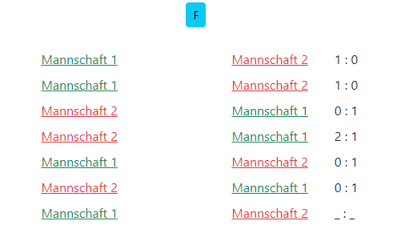

# KO-Results

Hack, der in KO-Spielen die Paarungen gemäß Heimrecht für jede Partie anzeigt.
Dabei wird bei Best of 5 und Best of 7 berücksichtigt, dass zunächst 2 Heimspiele und 2 Auswärtsspiele stattinden.
Die nachfolgenden Paarungen werden dann abwechselnd angezeigt.

### Installation

Datei überschreiben
